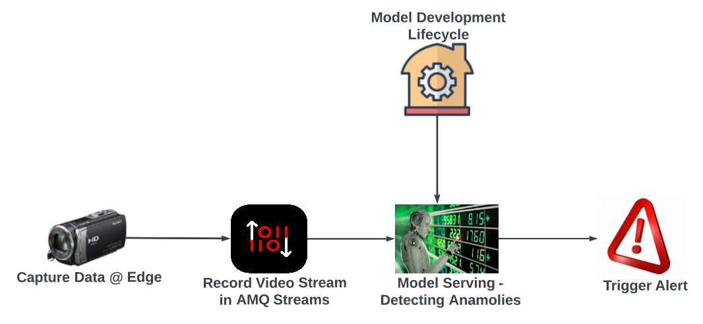

# What this lab covers
The labs is intended to showcase the capability of RH components, and how these components can be composed to provide modern applications.
The application here is an example of predictive maintenance system which collects data from edge and analyse it for anomalies. 
The aim of this lab are as follows
- Show how RH Managed service offerings make application lifecycle faster and scalable
- Show how RH Data Science makes it easy to build and deploy models.
- How different components works together to solve a business problem.
The application first collects data from the edge devices such as cameras and send the raw data to the AMQ Streams. A consumer to the stream will perform inference and generate alerts.
Data Science team use the platform to build (and re-train) and deploy the model in self-serving fashion.


# Technical Architecture


# How to run this lab
- Have an OCP cluster using RHPDS
- Run the deployments in the deploy folder to create Minio and model inferencing alongwith the consumer component. 
  - Make sure to change the enviornment variables in the deployment yamls
- Create a topic named vide-streams in RH AMQ Streams online and create service account for SASL Authentication
- Run the program in the event-producer folder (docker version is also available), to capture the video feed from your laptop (mimicing the edge device)
- Open the JS file in local browser to see the feed results

# Env Settings
```bash

export MINIO_USER="minio"
export MINIO_PASSWORD=""
export SASL_USERNAME=""
export SASL_PASSWORD=""
export KAFKA_BROKER=""
export GROUP_ID="imageclassification"
export MINIO_SERVER=""
export PARALLEL_INFERENCE=15
export PROMETHEUS_SERVER=localhost:9090
export MODEL_URL="http://model-1-pred-demo-fmv3.apps.dbs-indo-1.apac-1.rht-labs.com/api/v1.0/predictions
```


# Run producer
```bash 
brew install go
brew isntall opencv
```